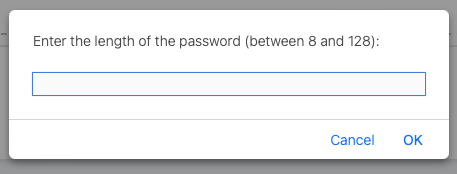
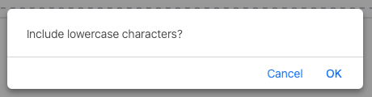
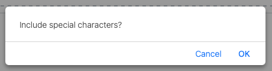
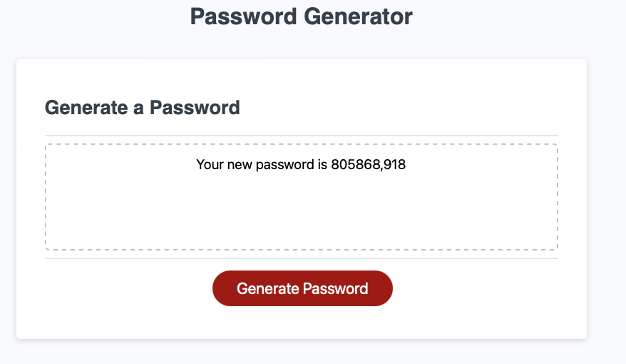

# Password Generator

## Overview

An application that anyone can use to generate a random password based on criteria they’ve selected. The critiria offered are length, lower case, upper case, numeric and special characters.

## Instructions

As the user steps through the application the user is presented with a number of options by way of prompts.

The first, length is required a required parameter and if the user cancels they will be navigated out of the application. If the length is less than 8 or greater than 128 an error message will be displayed.

The next selections are optional, although one must be provided.

 

 

The following image shows the web application's appearance and functionality when the password is generated:

## Getting Started

* Clone the repository
* Open the index.html file in your browser.

or you can view a deployed version here: https://timeades.github.io/Password-Generator/

